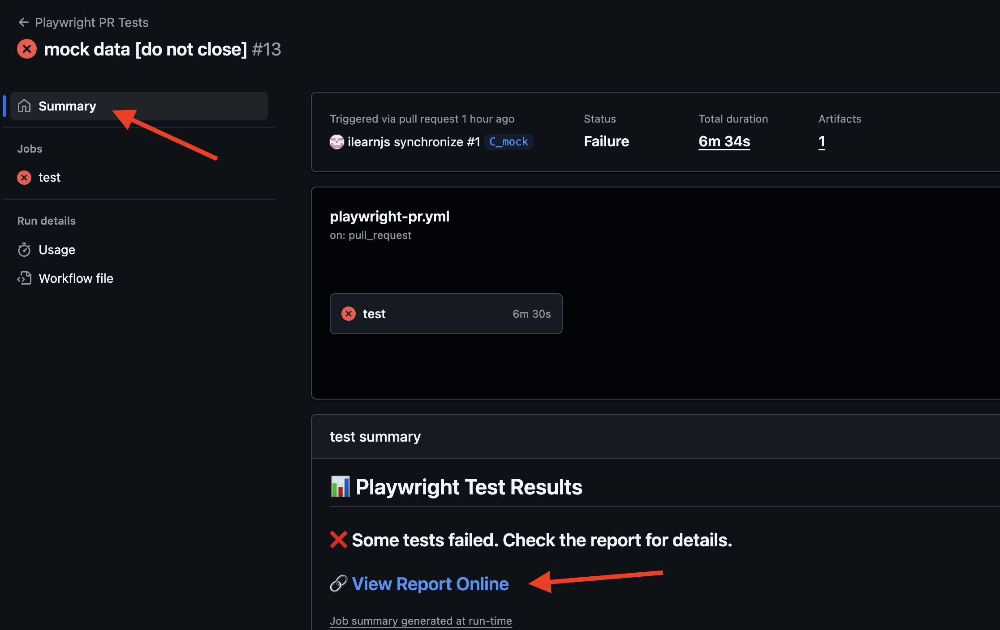
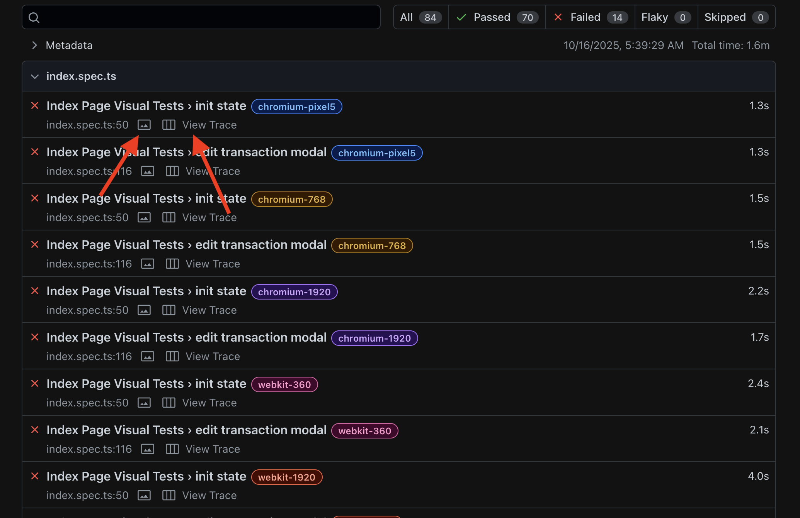
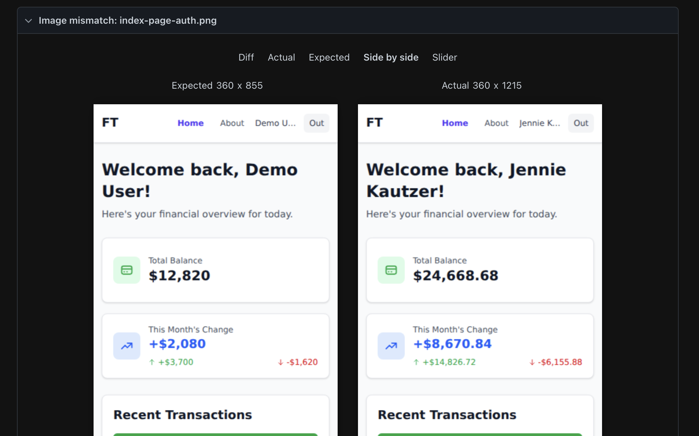
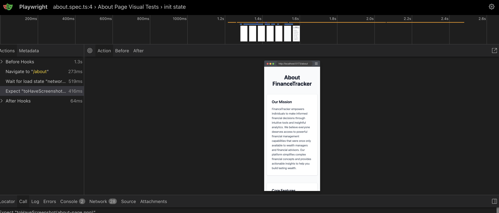
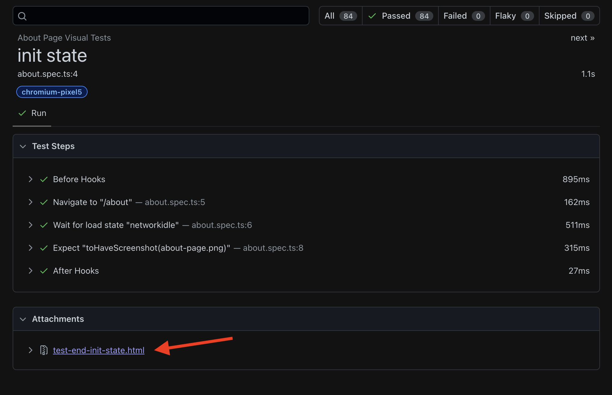

# Playwright Test Reports and Page State Debugging

This guide explains how to access and use Playwright test reports for debugging failed tests and reviewing test execution.

## 📊 Accessing Test Reports

After each test run, Playwright generates a comprehensive HTML report that's automatically uploaded to our CDN.

### Finding the Report Link

Navigate to the **GitHub Actions workflow summary** where you'll find a direct link to the test report:

## Report Features

### Test Summary Dashboard

The main report page provides:
- **Overall test statistics** - Pass/fail counts and duration
- **Test suite breakdown** - Results grouped by test file
- **Individual test details** - Each test's status and artifacts

### Automatic Page State Capture

Every test automatically captures:
- **HTML snapshot** - Complete page content after test execution
- **Failure screenshots and Execution traces** - Full-page screenshots and Step-by-step test execution (for failed tests)

## Debugging Failed Tests

### Visual Regression Failures

When visual tests fail, the report provides powerful comparison tools (opens by clicking img icon)

### Trace Viewer

For deeper debugging of failed tests (opens by clicking open trace link):

### Page State Analysis

To inspect the final page state after test execution:

1. **Open the test details** by clicking on the test name
2. **Click the HTML attachment** (e.g., `test-end-init-state.html`)
3. **View the complete page** as it appeared when the test completed

## Technical Implementation

The automatic page state capture is configured in [`fe/tests/_setup.ts`](../fe/tests/_setup.ts):

- HTML content is captured after every test
- Screenshots are captured only on test failures
- All attachments are named with the test title for easy identification

This ensures comprehensive debugging information is always available without manual intervention in test code.